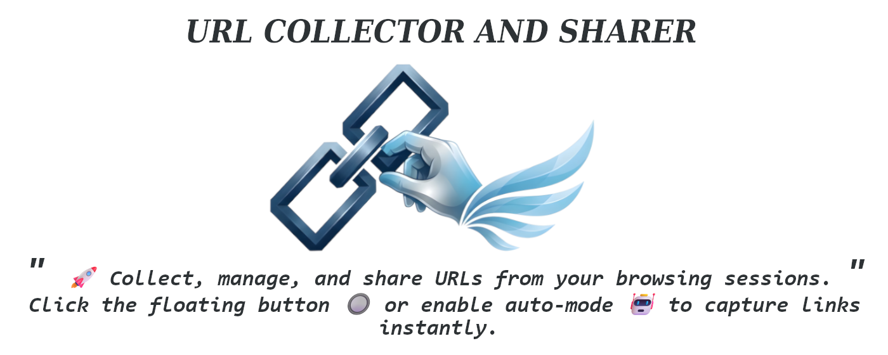

# 🚀 URL Collector and Sharer

[](https://github.com/Mavros-Lykos/url-collector)
[](https://opensource.org/licenses/MIT)
[](https://chrome.google.com/webstore/detail/your-extension-id)



**URL Collector and Sharer** is a powerful, lightweight Chrome extension designed to help you capture, manage, and share URLs instantly. Whether you're researching, curating content, or just trying to keep track of interesting finds across the web, URL Collector makes the process seamless and efficient.

> [!TIP]
> Never lose track of a tab again. Collect URLs with a single click and manage them all in one place.

---

### 🌟 Why URL Collector?
Tired of messy bookmarks and lost tabs? URL Collector provides a temporary, session-based workspace to gather links from any website—including dynamic platforms like YouTube Shorts and Pinterest—without breaking your flow.

---

### ✨ Key Features

- **🔘 Floating Action Button**: A non-intrusive `+` button stays with you as you browse, allowing for one-click URL capture without opening the extension popup.
- **⚡ Auto-Collection Mode**: Enable this to automatically capture Every URL you visit. Perfect for research sessions or scrolling through social media feeds.
- **📱 Smart Management UI**: A clean, intuitive popup interface where you can view your collected links, complete with site favicons for easy identification.
- **🛠️ Bulk Actions**:
    - Select/Deselect all or specific links.
    - Delete unwanted catches in bulk.
    - Copy selected URLs to clipboard in a clean list format.
- **📥 Import & Export**:
    - **Export** your session data to **JSON**, **CSV**, or **TXT** formats.
    - **Import** previously exported files to restore or merge your collection.
- **📂 Batch Open**: Open your collected links all at once in a **New Window** or **Incognito Mode**.
- **🔒 Privacy First (Session-Based)**: All collected data is kept locally and cleared when you restart your browser, ensuring a fresh workspace every time.

---

### 🚀 Getting Started

#### Installation (Manual Mode)
Since this extension is in development, you can install it manually:

1.  **Clone the repository**:
    ```bash
    git clone https://github.com/Mavros-Lykos/url-collector.git
    ```
2.  **Open Chrome Extensions**:
    Open Chrome and navigate to `chrome://extensions/`.
3.  **Enable Developer Mode**:
    Toggle the **Developer mode** switch in the top-right corner.
4.  **Load Unpacked**:
    Click the **Load unpacked** button and select the root folder of this project.

#### 📖 How to Use

1.  **Collect a URL**: Click the floating `+` button on any webpage to save it to your list.
2.  **Manage Your List**: Click the extension icon in your toolbar to open the manager.
3.  **Use Auto-Mode**: Toggle "Auto Collection" in the popup to capture links as you browse without clicking anything.
4.  **Export Your Data**: Use the "Export" button to save your links as a JSON, CSV, or TXT file for later use.
5.  **Batch Open**: Import a saved list and use the "Open" options to launch all links in a fresh window.

---

**Next Section: Technical Details & Privacy** (Awaiting your approval...)


